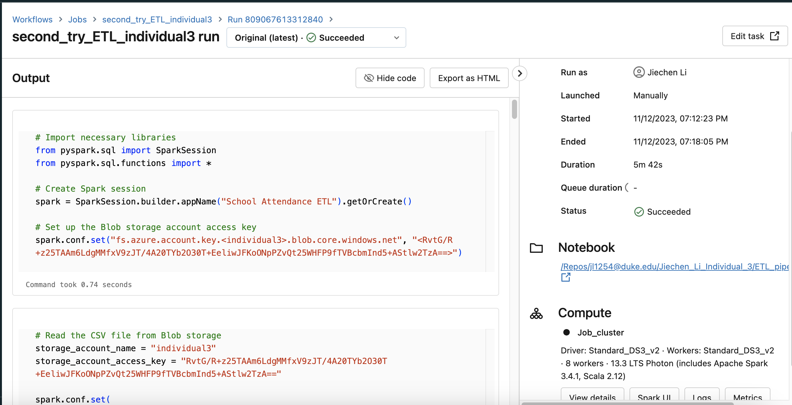

[](https://github.com/nogibjj/Jiechen_Li_Mini_6_MySQL/actions/workflows/ci.yml)

## Jiechen_Li_Individual_3

### Purpose

* A well-documented Databricks notebook that performs ETL (Extract, Transform, Load) operations, checked into the repository.
* Usage of Delta Lake for data storage.
* Usage of Spark SQL for data transformations.
* Proper error handling and data validation.
* Visualization of the transformed data.
* An automated trigger to initiate the pipeline.

### Dataset

The dataset is sellcted from [DATA.GOV](https://catalog.data.gov/dataset/school-attendance-by-student-group-and-district-2021-2022/resource/d923f39c-c84c-4fa9-a252-c1f6b465bd55) in the United States.
The dataset appears to represent attendance data for various student groups across different districts in Connecticut for the academic years 2021-2022, 2020-2021, and 2019-2020.

### Databricks Notebook Performs ETL

1. **Extract: Read the CSV file from Azure Blob storage.**

```python
# Import necessary libraries
from pyspark.sql import SparkSession
from pyspark.sql.functions import *

# Create Spark session
spark = SparkSession.builder.appName("School Attendance ETL").getOrCreate()

# Set up the Blob storage account access key
spark.conf.set("fs.azure.account.key.<individual3>.blob.core.windows.net", "<RvtG/R+z25TAAm6LdgMMfxV9zJT/4A20TYb2O30T+EeliwJFKoONpPZvQt25WHFP9fTVBcbmInd5+AStlw2TzA==>")

# Read the CSV file from Blob storage
storage_account_name = "individual3"
storage_account_access_key = "RvtG/R+z25TAAm6LdgMMfxV9zJT/4A20TYb2O30T+EeliwJFKoONpPZvQt25WHFP9fTVBcbmInd5+AStlw2TzA=="

spark.conf.set(
  f"fs.azure.account.key.{storage_account_name}.blob.core.windows.net",
  storage_account_access_key)

csv_file_path = "wasbs://schoolattendance@individual3.blob.core.windows.net/School_Attendance_by_Student_Group_and_District__2021-2022.csv"
df = spark.read.csv(csv_file_path, header=True, inferSchema=True)
df.show()

```

2. **Transform: Perform the necessary transformations on the data.**

```python
# Transform Data Using SQL
# Register the DataFrame as a temp view
df.createOrReplaceTempView("School_Attendance_Table")

# Example Transformation: Create new table with specific columns
transformed_df = spark.sql("""
    SELECT 
        "District code" AS District_code, 
        "District name" AS District_name, 
        Category, 
        "Student group" AS Student_group, 
        "2021-2022_student_count_-_year_to_date" AS Student_count, 
        "2021-2022_attendance_rate_-_year_to_date" AS Attendance_rate 
    FROM School_Attendance_Table
""")
transformed_df.show()

```

3. **Load: Save the transformed data back to Azure Blob storage, potentially as a Delta Lake table for efficient querying and storage.**

```python
# Load Transformed Data into Delta Lake
# Define the path to store the Delta table
delta_table_path = "/mnt/delta/School_Attendance_Transformed"

# Write the DataFrame as a Delta table
transformed_df.write.format("delta").mode("overwrite").save(delta_table_path)

# Read from Delta Lake
delta_df = spark.read.format("delta").load(delta_table_path)
delta_df.show()
```

Please check ``ETL_pipeline_within_repo.py`` for detailed output.

### Results

1. **Connect GitHub Repo with Databricks Repo**
<br>  

2. **Transformed data in Delta Lake to Interact with Spark SQL**
<br/>

3. **Data Visualization**
<br/>

4. **Commit from Databricks to GitHub Repo**
<br/>

5. **Automated Trigger**
<br/>

### Recommendation for Management Team

The goal of this analysis is to compare the attendance rates of the "All Students" group in the 2021-2022 academic year against the rates in the 2020-2021 academic year for each district. We want to find districts where the attendance rate increased, remained stable (with a variation of less than 1%), or decreased. The results show that the attendance rate in 2020-2021 is better than 2021-2022 in general. We may consider the Covid in 2021-2022 into consideration when analyze this result.

### Demo Video

1. [Automated Trigger Walkthrough Video](https://youtu.be/NVmPZFgrJ2Q)
2. Please click <a href="https://youtu.be/cYU2Ll8q330" target="_blank">here</a> to watch the explanatory Demo Video of this repo.

### Reference

Please click <a href="https://github.com/nogibjj/Jiechen_Li_Mini_10_PySpark.git" target="_blank">here</a> to see the template of this repo.
